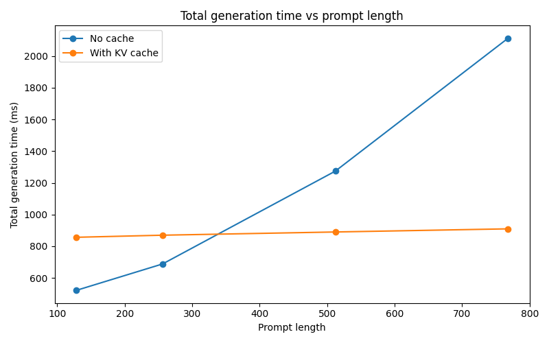
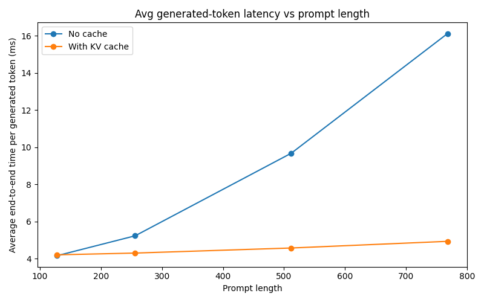
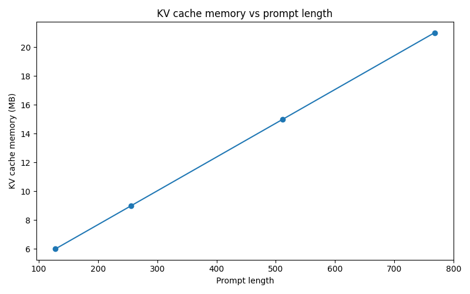
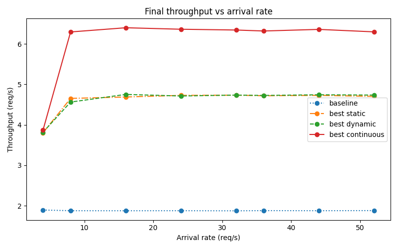
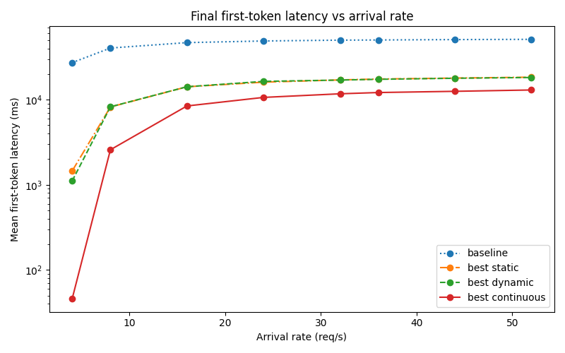
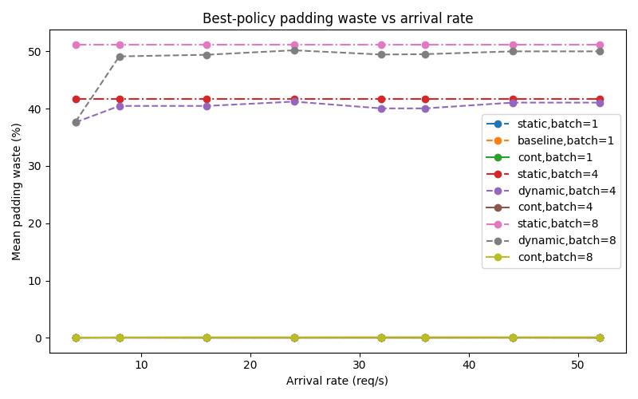

# Efficient Inference Systems: KV Cache and Batching Scheduler Tradeoffs in a Controlled Transformer Serving Benchmark

## Overview

This project is a controlled transformer inference benchmark focused on two serving mechanisms:

1. **KV caching** for incremental autoregressive decoding
2. **Batching scheduler design** under heterogeneous request traffic

The repository contains both the inference-system implementation and the benchmarking code used to evaluate it.

## Key Contributions

- Implemented a small decoder-only transformer inference stack in PyTorch with separate no-cache and KV-cache generation paths
- Built a **block-managed per-request KV cache** plus a batched cache wrapper for heterogeneous request execution
- Implemented **static**, **dynamic**, and **continuous** batching schedulers over a shared cached inference path
- Built **continuous batching** with strict decode priority, chunked prefill, and request-local cache state across iterations
- Measured throughput, request latency, first-token latency, p99 latency, padding waste, and KV-cache memory growth under synthetic mixed workloads

## Repository Structure

- `src/model/`: transformer and causal self-attention
- `src/cache/`: per-request and batched KV-cache abstractions
- `src/inference/`: no-cache and KV-cache generation loops
- `src/serving/`: request model, load generation, schedulers, and serving metrics
- `experiments/kv_cache_analysis/`: KV-cache benchmark and memory-growth analysis
- `experiments/dynamic_batching/`: scheduler benchmark, quick comparisons, and plotting
- `results/`: generated plots and raw benchmark outputs

---

## System

### Model configuration

| Parameter                  | Value |
| -------------------------- | ----: |
| Vocabulary size            |  5000 |
| Hidden size (`d_model`)    |   512 |
| Attention heads            |     8 |
| Transformer layers         |     6 |
| Feed-forward size (`d_ff`) |  2048 |
| Max sequence length        |  1024 |

### Environment

| Component  | Value             |
| ---------- | ----------------- |
| Instance   | AWS `g4dn.xlarge` |
| GPU        | NVIDIA Tesla T4   |
| GPU memory | 14.56 GB          |
| Python     | 3.12.3            |
| PyTorch    | 2.9.1+cu130       |
| CUDA       | 13.0              |
| cuDNN      | 91300             |
| Precision  | FP32              |

---

## Model And Inference

The project uses a small **decoder-only transformer** implemented in PyTorch as a controlled testbed for inference-system experiments. The focus is on serving behavior, KV-cache reuse, and batching tradeoffs rather than model quality.

The model uses learned token and positional embeddings, 6 transformer blocks with causal self-attention, and a linear LM head. Generation is autoregressive and uses **greedy decoding** by taking `argmax` over the final-token logits at each step.

Two inference paths are implemented:

1. **No-cache generation**
   - reruns the model on the full sequence at every decode step
   - serves as the recomputation baseline

2. **KV-cache generation**
   - runs a prompt **prefill** pass once
   - stores per-layer keys and values
   - reuses cached K/V during decode
   - feeds only the newest token at each decode step

This prefill/decode split is the key inference distinction used throughout the project.

---

## KV Cache Design

The KV cache is implemented as a block-managed per-request cache, not as one contiguous tensor that grows every step.

For each request and each transformer layer, the cache stores:

- key blocks
- value blocks
- cached sequence length

Each block stores a fixed number of token positions (e.g., 16 tokens), enabling append without reallocating large contiguous tensors.

For batched execution, the system wraps per-request caches in a batched cache abstraction that:

- preserves independent request state
- supports variable valid token counts across requests
- tracks per-request past lengths
- materializes temporary padded dense K/V tensors only at compute time

Why this matters:

- avoids reallocating one large contiguous cache tensor on every append
- enables incremental decode cleanly
- supports batched cached execution and heterogeneous request progress

Tradeoff:

- the persistent cache layout is block-managed, but attention still uses temporary padded dense tensors at compute time
- this is conceptually similar to paged KV-cache management, but it is not a custom paged-attention kernel

Cache memory grows approximately linearly with sequence length because each additional token contributes one key and one value vector per layer.

## Scheduler Designs

All scheduler experiments run on top of the **KV-cache inference path**, so the comparison isolates scheduling policy rather than model execution differences.

### Baseline

The no-batching baseline is represented by dynamic scheduling with `max_batch_size = 1`.

- requests execute one at a time
- no batching benefit is possible

### Static batching

FIFO whole-request batching:

- maintain a FIFO queue of arrived requests
- dispatch only when `max_batch_size` requests are available
- flush the remaining partial batch when arrivals end
- execute each batch non-preemptively to completion

### Dynamic batching

FIFO whole-request batching with a timeout:

- maintain a FIFO queue of arrived requests
- dispatch immediately when the batch fills
- otherwise wait until the oldest request exceeds `batch_timeout_ms`
- execute each batch non-preemptively to completion

### Continuous batching

Token-level scheduling with chunked prefill and strict decode priority:

- maintain a FIFO `waiting` queue and an `active` set
- admit requests into `active` up to `max_batch_size`
- advance all active decode requests first
- spend the remaining token budget on prompt prefill work
- keep per-request KV-cache state across iterations

---

## Continuous Batching Internals

Each request moves through four phases:

1. **Waiting**
2. **Prefill**
3. **Decode**
4. **Finished**

The scheduler loop works as follows:

1. advance simulated time when idle
2. enqueue newly arrived requests
3. admit waiting requests into the active set
4. run one decode step for all active decode requests
5. subtract decode tokens from the per-iteration token budget
6. use the remaining budget for prompt prefill work

Prefill is **chunked**, not whole-request. Prefill requests are grouped by shared prompt progress, and the scheduler selects the largest eligible group first. Once a prompt finishes, the request emits its first token and moves into decode.

Decode always has priority over prefill in the same iteration. That reduces first-token and tail latency by preventing active decode requests from being blocked behind long prompt ingestion.

Continuous batching also reduces padding waste because:

- prefill is done in smaller chunks instead of full prompts
- requests are grouped by equal prompt progress
- decode advances one token per active request

This greatly reduces the prompt-length mismatch seen in whole-request batching.

---

## Workload Model

Requests are generated synthetically to mimic heterogeneous serving traffic.

### Arrival process

Requests arrive according to a **Poisson process** using exponentially distributed inter-arrival times.

### Request classes

The default workload is a weighted mixture of:

- `short_qa`
- `chat_turn`
- `rag_answer`
- `long_summary`

Each class defines:

- prompt length range
- decode length range
- sampling weight

Within each class, prompt length and decode length are sampled uniformly from the configured range.

Why this matters:

- heterogeneous shapes expose prompt-padding waste
- long prompts create head-of-line blocking pressure
- scheduler policy has a real effect on first-token and tail latency

---

## Running The Experiments

From the repository root, run:

- `python experiments/kv_cache_analysis/run_all.py`
- `python experiments/dynamic_batching/run_all.py`

These scripts generate raw outputs under `results/` and then produce the plots shown in the README.

---

## Experimental Configuration

### KV cache experiment

| Parameter      | Value                  |
| -------------- | ---------------------- |
| Prompt lengths | `[128, 256, 512, 768]` |
| Max new tokens | `128`                  |
| Repeats        | `3`                    |
| Warmup runs    | `1`                    |
| Batch size     | `1`                    |
| Seed           | `42`                   |

### Scheduler experiment

| Parameter                                              | Value                                                                                                                                                                  |
| ------------------------------------------------------ | ---------------------------------------------------------------------------------------------------------------------------------------------------------------------- |
| Arrival rates (req/s)                                  | `[4.0, 8.0, 16.0, 24.0, 32.0, 36.0, 44.0, 52.0]`                                                                                                                       |
| Max batch sizes                                        | `[1, 4, 8]`                                                                                                                                                            |
| Dynamic timeouts (ms)                                  | `[0.0, 10.0, 20.0]`                                                                                                                                                    |
| Static policy                                          | dispatch on full batch                                                                                                                                                 |
| Continuous prefill chunk sizes                         | `[128, 256]`                                                                                                                                                           |
| Requests per run                                       | `200`                                                                                                                                                                  |
| Repeats                                                | `3`                                                                                                                                                                    |
| Seed                                                   | `42`                                                                                                                                                                   |
| Workload classes (weight, prompt range / decode range) | short_qa (`0.35`, `48-160` / `16-48`), chat_turn (`0.35`, `128-320` / `32-96`), rag_answer (`0.20`, `256-640` / `64-160`), long_summary (`0.10`, `512-768` / `96-256`) |

---

## Metrics

The benchmark records metrics at request, batch/event, and run level.

### Request-level metrics

- **wait time**: dispatch time minus arrival time
- **service time**: finish time minus dispatch time
- **request latency**: finish time minus arrival time
- **first-token latency**: first generated token time minus arrival time

### Run-level metrics

- **throughput (req/s)**: completed requests divided by run makespan
- **throughput (tokens/s)**: total generated tokens divided by run makespan
- **mean / p50 / p95 / p99 latency**
- **mean / p95 wait time**
- **mean first-token latency**
- **mean batch size**
- **mean batch runtime**
- **mean active requests**
- **padding waste** in tokens, bytes estimate, and percentage
- **prefill tokens total** and **decode tokens total**

### Memory metrics

- total KV-cache memory in MB
- cache growth during decode
- GPU allocated memory
- GPU peak allocated memory

Timing uses explicit CUDA synchronization before and after measured regions so GPU timings reflect actual elapsed execution time.

---

## Results

### 1. KV Cache

KV caching changes the scaling behavior of decode. Over the tested prompt lengths, the no-cache path became increasingly expensive, while the cached path kept generated-token latency much flatter once prompt length was large enough to overcome cache overhead, at the cost of additional memory.

### Latency behavior

<table>
  <tr>
    <td align="center">
      
    </td>
    <td align="center">
      
    </td>
  </tr>
</table>

By prompt length `768`, the cached path was `2.32x` faster end to end. Generated-token latency rose from about `4.07 ms` to `16.51 ms` without caching, while staying roughly in the `6.69-7.11 ms` range with caching.

### Memory behavior

  

Cache memory grew approximately linearly over the tested range, from `6.0 MB` at prompt length `128` to `21.0 MB` at `768`.

### Summary table

| Prompt Length | No Cache Total (ms) | With Cache Total (ms) | Cache Prefill (ms) | Cached Token Latency (ms) | Speedup | Cache Memory (MB) |
| ------------- | ------------------: | --------------------: | -----------------: | ------------------------: | ------: | ----------------: |
| 128           |              521.16 |                856.48 |               8.05 |                      6.69 |   0.61x |               6.0 |
| 256           |              688.12 |                869.64 |              11.23 |                      6.79 |   0.79x |               9.0 |
| 512           |             1273.93 |                889.94 |              17.19 |                      6.95 |   1.43x |              15.0 |
| 768           |             2112.83 |                909.78 |              22.73 |                      7.11 |   2.32x |              21.0 |

---

### 2. Scheduler Comparison

The scheduler benchmark compares baseline, static, dynamic, and continuous batching under heterogeneous traffic. The comparison is about throughput, first-token latency, tail latency, and padding efficiency as offered load increases.

| Metric / Plot                                                              | Baseline                              | Dynamic                               | Static              | Continuous                           |
| -------------------------------------------------------------------------- | ------------------------------------- | ------------------------------------- | ------------------- | ------------------------------------ |
| Throughput (`throughput_mode_comparison_final.png`)                        | `dynamic`, batch `1`, timeout `20 ms` | `dynamic`, batch `8`, timeout `20 ms` | `static`, batch `8` | `continuous`, batch `8`, chunk `256` |
| P99 latency (`p99_latency_mode_comparison_final.png`)                      | `dynamic`, batch `1`, timeout `20 ms` | `dynamic`, batch `8`, timeout `20 ms` | `static`, batch `8` | `continuous`, batch `8`, chunk `256` |
| First-token latency (`mean_first_token_latency_mode_comparison_final.png`) | `dynamic`, batch `1`, timeout `20 ms` | `dynamic`, batch `8`, timeout `10 ms` | `static`, batch `8` | `continuous`, batch `8`, chunk `256` |

### Throughput and tail-latency behavior

<table>
  <tr>
    <td align="center">
      
    </td>
    <td align="center">
      
    </td>
  </tr>
</table>

Continuous batching delivered the strongest overall throughput and best tail behavior. At the highest tested load (`52 req/s`), continuous reached `6.30 req/s` with p99 latency around `27.53 s`, while dynamic and static remained near `4.74 req/s` and `4.70 req/s` with p99 latency around `38.42 s` and `38.75 s`.

### First-token latency behavior

  

First-token latency showed the clearest separation between scheduler types. Continuous batching returned first tokens earlier because it prioritized decode and chunked prefill instead of executing large whole-request batches non-preemptively.

### Padding behavior

  

Padding waste helps explain the scheduler ranking. Static and dynamic whole-request batching padded each batch to the longest request dispatched, which produced substantial waste once the workload became heterogeneous. Continuous batching stayed near zero padding waste because it used chunked prefill and incremental decode rather than full-prompt padded batches.

### Summary table

| Scheduler           | Best Throughput Range (req/s) | Best P99 Latency Range | Best First-Token Latency Range | Padding Waste |
| ------------------- | ----------------------------: | ---------------------: | -----------------------------: | ------------: |
| Baseline            |                   `1.87-1.89` |       `54.48-101.64 s` |                `27.24-51.18 s` |          `0%` |
| Dynamic batching    |                   `3.82-4.75` |         `4.73-38.42 s` |                 `1.11-18.23 s` |  `37.6-50.0%` |
| Static batching     |                   `3.80-4.73` |         `4.98-38.75 s` |                 `1.45-18.38 s` |  `41.7-51.2%` |
| Continuous batching |                   `3.87-6.40` |         `2.81-27.53 s` |             `45.68 ms-13.00 s` |  `0.01-0.10%` |

The implementation choices behind the continuous scheduler explain the gains:

- strict decode prioritization
- chunked prefill instead of whole-request prompt execution
- request-local KV-cache state across iterations
- near-zero prompt-padding waste

---

## Simplifications And Production Gaps

This project is a controlled inference benchmark and serving simulator, not a full production inference stack.

Not implemented:

- pretrained checkpoint loading
- tokenizer or text input pipeline
- EOS or stop-sequence handling
- sampling strategies such as top-k, top-p, or temperature
- custom paged-attention kernels
- multi-GPU or distributed serving
- async RPC serving infrastructure
- KV-cache eviction, offload, or compaction
- realistic production request traces

These omissions are intentional. The goal is to isolate the serving-level tradeoffs around cache reuse, batching policy, queue buildup, padding waste, and memory growth in a system that remains small enough to understand end to end.

---

## Conclusion

This benchmark isolates two core serving behaviors:

1. **KV caching** reduces decode-time growth as context length increases, at the cost of memory that grows roughly linearly with cached sequence length.
2. **Scheduler design** strongly affects throughput, first-token latency, tail latency, and padding efficiency under heterogeneous traffic.

In this implementation, continuous batching delivered the strongest overall performance by combining:

- higher throughput
- lower first-token latency
- better tail-latency behavior
- near-zero padding waste

Although the benchmark is intentionally simplified, the core tradeoffs it exposes are the same ones that shape modern transformer inference systems.
