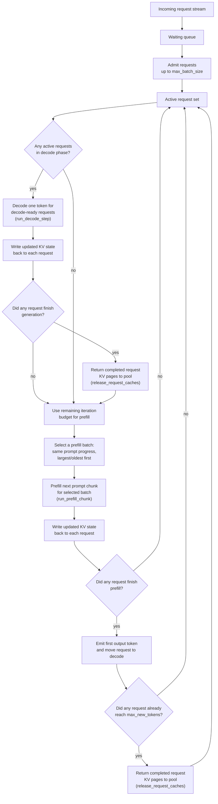
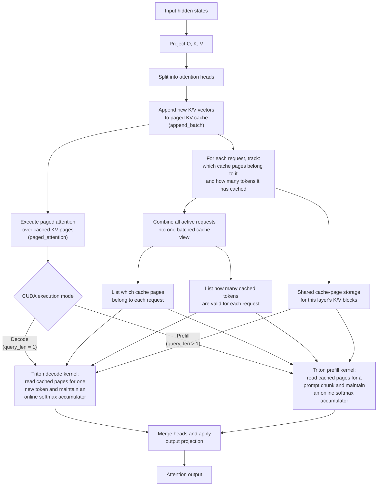
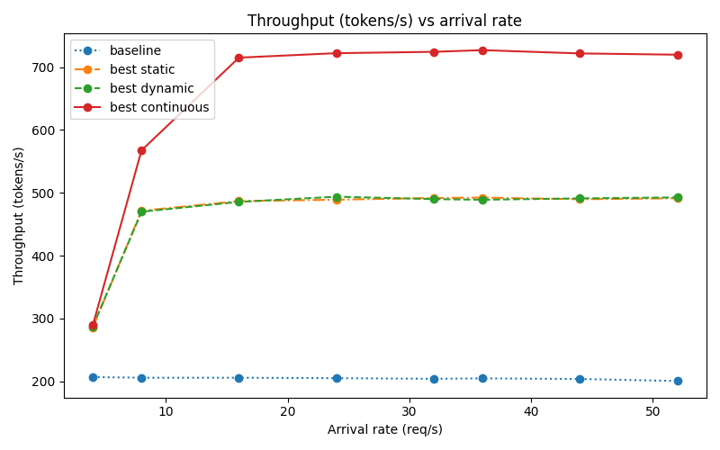
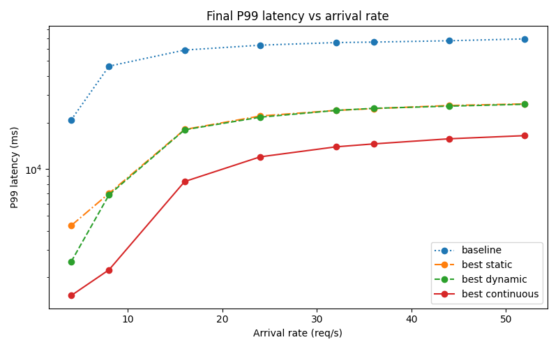
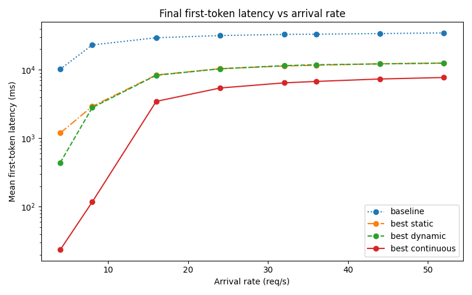
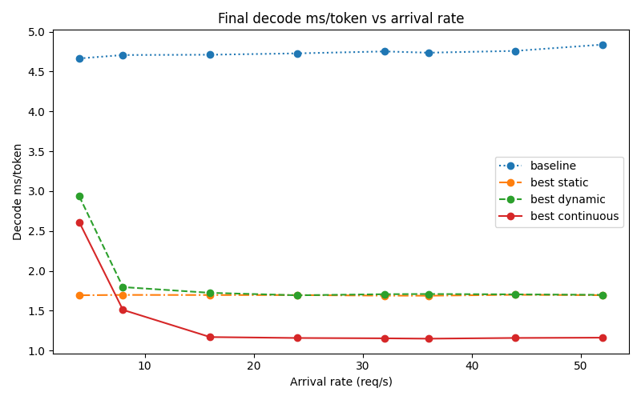
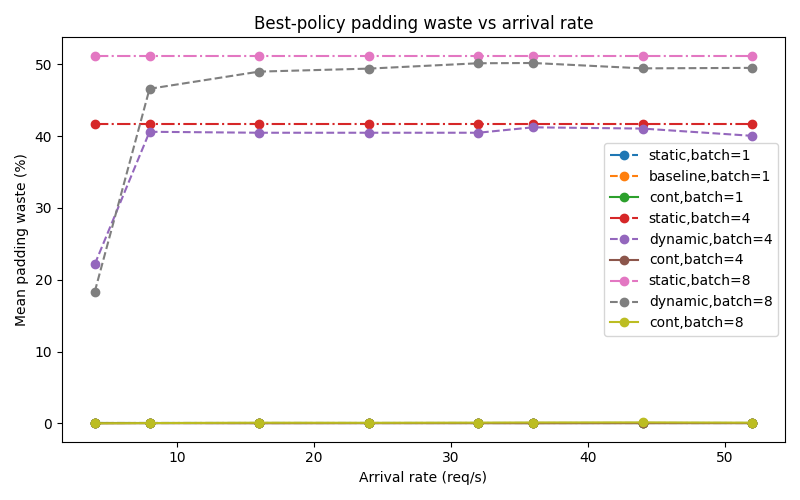
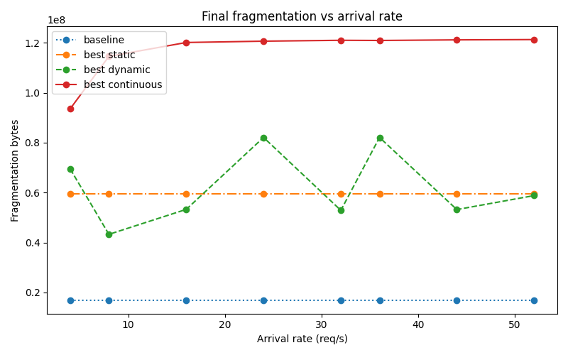

# Triton-Backed Paged Attention and Continuous Batching

## Overview

This repository implements a small paged-attention serving stack in PyTorch and Triton.

The system uses shared per-layer paged KV storage, Triton decode and prefill kernels, and static, dynamic, and continuous batching schedulers.

The main goal is to show how paged KV execution changes cached attention behavior and how batching policy changes throughput and latency under heterogeneous request traffic.

The artifact consists of:

- a small decoder-only transformer in PyTorch
- paged KV storage with shared per-layer block pools and per-request page ownership
- a CUDA Triton paged-attention backend with separate decode and prefill kernels
- static, dynamic, and continuous batching schedulers
- experiment harnesses for KV-cache behavior and scheduler tradeoffs

Across the tested workload, continuous batching delivered the best throughput and latency, while reserving the largest KV footprint.

## How The Engine Works

### Continuous serving flow

Continuous batching keeps a FIFO waiting queue and an active request set. Each scheduler iteration gives priority to active decode requests, then spends any remaining token budget on chunked prefill work. Requests that have reached the same prompt-progress offset are prefetched together, which lets the executor batch prompt chunks cleanly while preserving request-local KV state across iterations.

### CUDA paged attention execution

At each cached attention step, the layer projects new `Q`, `K`, and `V`, appends the new `K/V` vectors into paged storage, and then executes attention directly from the cached pages. The CUDA path specializes into:

- a **decode kernel** for one-token autoregressive steps
- a **prefill kernel** for multi-token prompt chunks

Both kernels use request-level page metadata and valid sequence lengths to locate cached K/V pages in shared block storage during attention execution.

Each layer stores K/V in a shared paged block pool, while each request tracks its own page assignments and valid cached length. During batched execution, the runtime builds per-request page metadata and sequence lengths, and the Triton decode and prefill kernels read cached pages directly while maintaining an online softmax accumulator. When a request completes, its pages are returned to the shared pool.

## Batching Policies

### Baseline

The no-batching baseline is represented by dynamic scheduling with `max_batch_size = 1`.

### Static batching

FIFO whole-request batching:

- queue requests in arrival order
- dispatch once the queue reaches `max_batch_size`
- if the arrival trace ends with an incomplete batch, dispatch the remaining requests once no more arrivals can occur
- execute each batch non-preemptively to completion

### Dynamic batching

FIFO whole-request batching with timeout:

- queue requests in arrival order
- dispatch immediately on a full batch
- otherwise wait until the oldest queued request exceeds `batch_timeout_ms`
- execute each batch non-preemptively to completion

### Continuous batching

Token-level scheduling with chunked prefill:

- maintain a waiting queue and an active set
- admit requests into the active set up to `max_batch_size`
- decode active decode-phase requests first
- spend any remaining per-iteration budget on prefill work
- keep request-local KV state across scheduler iterations
- release request pages when generation completes

The continuous scheduler is the main artifact policy of interest.

---

## Workload Model

Requests are generated synthetically to mimic heterogeneous serving traffic.

### Arrival process

Requests arrive according to a Poisson process using exponentially distributed inter-arrival times.

### Request classes

The default workload is a weighted mixture of:

- `short_qa`
- `chat_turn`
- `rag_answer`
- `long_summary`

Each class defines:

- prompt length range
- decode length range
- sampling weight

Within each class, prompt and decode lengths are sampled uniformly from the configured range.

This workload is intentionally heterogeneous because it exposes:

- prompt-padding waste in whole-request batching
- head-of-line blocking from long prompts
- scheduler effects on first-token and tail latency

---

## Experimental Setup

### Model configuration

| Parameter                  | Value |
| -------------------------- | ----: |
| Vocabulary size            |  5000 |
| Hidden size (`d_model`)    |   512 |
| Attention heads            |     8 |
| Transformer layers         |     6 |
| Feed-forward size (`d_ff`) |  2048 |
| Max sequence length        |  1024 |
| KV block size              |    16 |

### Environment used for the current checked-in results

| Component  | Value             |
| ---------- | ----------------- |
| Instance   | AWS `g4dn.xlarge` |
| GPU        | NVIDIA Tesla T4   |
| GPU memory | 14.56 GB          |
| Python     | 3.12.3            |
| PyTorch    | 2.9.1+cu130       |
| CUDA       | 13.0              |
| cuDNN      | 91300             |
| Precision  | FP32              |

### KV-cache experiment

| Parameter      | Value                  |
| -------------- | ---------------------- |
| Prompt lengths | `[128, 256, 512, 768]` |
| Max new tokens | `128`                  |
| Repeats        | `3`                    |
| Warmup runs    | `1`                    |
| Batch size     | `1`                    |
| Seed           | `42`                   |

### Scheduler experiment

| Parameter                                              | Value                                                                                                                                                                  |
| ------------------------------------------------------ | ---------------------------------------------------------------------------------------------------------------------------------------------------------------------- |
| Arrival rates (req/s)                                  | `[4.0, 8.0, 16.0, 24.0, 32.0, 36.0, 44.0, 52.0]`                                                                                                                       |
| Max batch sizes                                        | `[1, 4, 8]`                                                                                                                                                            |
| Dynamic timeouts (ms)                                  | `[0.0, 10.0, 20.0]`                                                                                                                                                    |
| Static policy                                          | dispatch on full batch                                                                                                                                                 |
| Continuous prefill chunk sizes                         | `[128, 256]`                                                                                                                                                           |
| Continuous max tokens per iteration                    | `1536`                                                                                                                                                                 |
| Requests per run                                       | `200`                                                                                                                                                                  |
| Repeats                                                | `3`                                                                                                                                                                    |
| Seed                                                   | `42`                                                                                                                                                                   |
| Workload classes (weight, prompt range / decode range) | short_qa (`0.35`, `48-160` / `16-48`), chat_turn (`0.35`, `128-320` / `32-96`), rag_answer (`0.20`, `256-640` / `64-160`), long_summary (`0.10`, `512-768` / `96-256`) |

---

## Results

### 1. Scheduler comparison

The scheduler experiment compares baseline, static, dynamic, and continuous batching on top of the same cached paged-attention engine.

#### Throughput and tail latency

<table>
  <tr>
    <td align="center">
      
    </td>
    <td align="center">
      
    </td>
  </tr>
</table>

These figures show the main scheduler tradeoff under load. Throughput measures how well each policy keeps the accelerator busy as arrivals increase, while p99 latency shows the tail cost of whole-request batching versus token-level scheduling. Continuous batching benefits here by prioritizing decode work and using leftover iteration budget for chunked prefill.

#### First-token latency

  

First-token latency shows whether prompt work is being delayed behind long whole-request batches. Continuous batching reduces this delay by prioritizing decode-ready requests instead of waiting for full prompt-sized batches to finish.

#### Decode efficiency

  

Decode time per token (ms/token) shows how efficiently each policy sustains autoregressive generation under load. Continuous batching keeps decode cost per token lower than the baseline and whole-request schedulers, which helps explain its throughput and tail-latency gains.

#### Padding waste and KV fragmentation

<table>
  <tr>
    <td align="center">
      
    </td>
    <td align="center">
      
    </td>
  </tr>
</table>

Padding waste captures extra compute from forcing heterogeneous prompts into shared whole-request batches, while KV fragmentation shows how much reserved paged-KV memory is not part of live request state. In this artifact, higher fragmentation can also reflect a larger shared pool footprint under heavier continuous utilization, not just slack within partially filled pages.

#### Summary table

The table below summarizes the policy families shown in the scheduler comparison plots at the highest tested arrival rate (`52 req/s`).

| Mode       | Configuration                  | Throughput (req/s) | P99 Latency (ms) | Mean First-Token Latency (ms) | Decode ms/token | Padding Waste (%) | Fragmentation (MB) |
| ---------- | ------------------------------ | -----------------: | ---------------: | ----------------------------: | --------------: | ----------------: | -----------------: |
| baseline   | `batch=1`, `timeout=10 ms`     |               2.71 |            69326 |                         34698 |            4.84 |              0.00 |               16.7 |
| static     | `batch=8`                      |               6.64 |            26368 |                         12582 |            1.69 |             51.21 |               59.5 |
| dynamic    | `batch=8`, `timeout=20 ms`     |               6.65 |            26239 |                         12544 |            1.70 |             50.01 |               58.8 |
| continuous | `batch=8`, `prefill chunk=256` |               9.72 |            16461 |                          7734 |            1.16 |              0.09 |              121.3 |

At `52 req/s`, continuous batching delivered the best throughput, p99 latency, first-token latency, and decode efficiency, at the cost of the largest reserved-but-not-live KV footprint.

### 2. KV-cache behavior

The table and discussion below reflect the checked-in `results/kv_cache_analysis/raw/*.csv` files.

#### Latency behavior

<table>
  <tr>
    <td align="center">
      
    </td>
    <td align="center">
      
    </td>
  </tr>
</table>

Without caching, decode cost rises rapidly as prompt length grows because the model is repeatedly rerun on the current sequence. With caching, generated-token latency stays much flatter because the system reuses paged K/V and only processes the newest token during decode.

Caching is slower at short prompts because prefill overhead dominates, but it becomes beneficial once prompt length is large enough for decode reuse to amortize that cost.

#### Memory behavior

<table>
  <tr>
    <td align="center">
      
    </td>
    <td align="center">
      
    </td>
  </tr>
</table>

KV memory grows approximately linearly with prompt length in the single-request benchmark.

#### Summary table

| Prompt Length | No Cache Total (ms) | With Cache Total (ms) | Cache Prefill (ms) | Cached Generated-Token Time (ms) | Cached Decode-Only Token Time (ms) | Speedup | Cache Memory (MB) |
| ------------- | ------------------: | --------------------: | -----------------: | -------------------------------: | ---------------------------------: | ------: | ----------------: |
| 128           |              521.16 |                856.48 |               8.05 |                             6.69 |                               6.68 |   0.61x |               6.0 |
| 256           |              688.12 |                869.64 |              11.23 |                             6.79 |                               6.76 |   0.79x |               9.0 |
| 512           |             1273.93 |                889.94 |              17.19 |                             6.95 |                               6.87 |   1.43x |              15.0 |
| 768           |             2112.83 |                909.78 |              22.73 |                             7.11 |                               6.98 |   2.32x |              21.0 |

---

## Simplifications And Production Gaps

- no fixed-budget KV admission control
- no KV eviction, offload, or swap policy
- no cache compaction under memory pressure
- single-GPU only
- no distributed serving or RPC layer
- synthetic request traces rather than production traffic
- greedy decoding only
- no tokenizer or text-serving pipeline
- no EOS or stop-sequence handling
