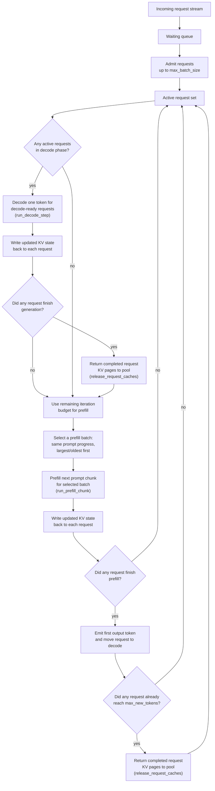
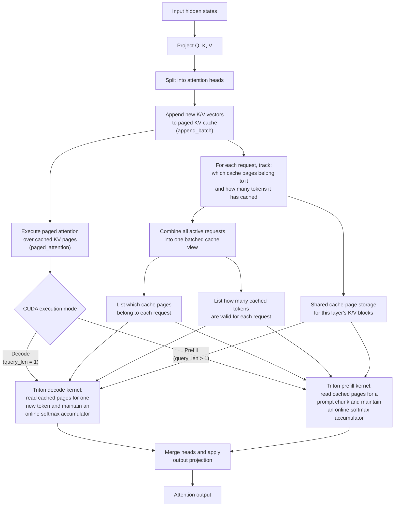
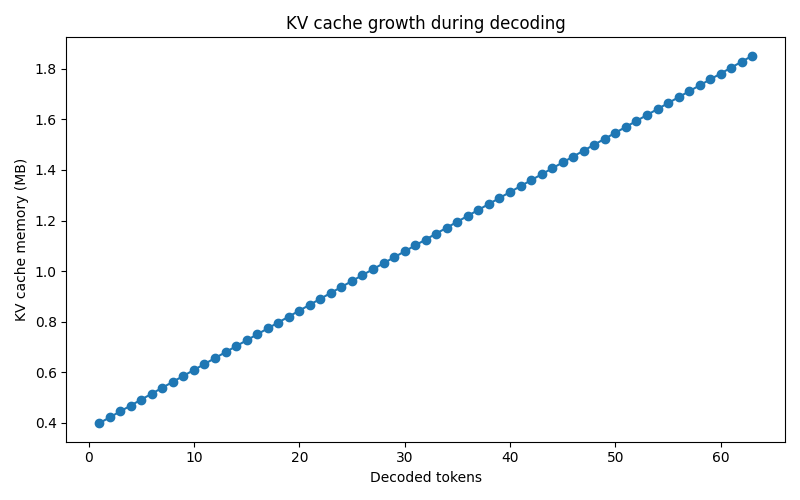

# Efficient Inference Systems: Triton-Backed Paged Attention and Batching Tradeoffs in a Controlled Transformer Serving Artifact

## Overview

This repository implements a compact transformer serving artifact for studying two inference-system questions:

1. how paged KV storage changes cached attention execution
2. how batching policy changes throughput and latency under heterogeneous request traffic

The serving stack executes batched cached attention directly from paged KV storage.

The artifact consists of:

- a small decoder-only transformer in PyTorch
- paged KV storage with shared per-layer block pools and per-request page ownership
- a CUDA Triton paged-attention backend with separate decode and prefill kernels
- static, dynamic, and continuous batching schedulers
- experiment harnesses for KV-cache behavior and scheduler tradeoffs

## How The Engine Works

### Continuous serving flow



Continuous batching keeps a FIFO waiting queue and an active request set. Each scheduler iteration gives priority to active decode requests, then spends any remaining token budget on chunked prefill work. Requests that have reached the same prompt-progress offset are prefetched together, which lets the executor batch prompt chunks cleanly while preserving request-local KV state across iterations.

### CUDA paged attention execution



At each cached attention step, the layer projects new `Q`, `K`, and `V`, appends the new `K/V` vectors into paged storage, and then executes attention directly from the cached pages. The CUDA path specializes into:

- a **decode kernel** for one-token autoregressive steps
- a **prefill kernel** for multi-token prompt chunks

Both kernels use request-level page metadata and valid sequence lengths to locate cached K/V pages in shared block storage during attention execution.

Each layer stores K/V in a shared paged block pool, while each request tracks its own page assignments and valid cached length. During batched execution, the runtime builds per-request page metadata and sequence lengths, and the Triton decode and prefill kernels read cached pages directly while maintaining an online softmax accumulator. When a request completes, its pages are returned to the shared pool.

---

## System Configuration

### Model configuration

| Parameter                  | Value |
| -------------------------- | ----: |
| Vocabulary size            |  5000 |
| Hidden size (`d_model`)    |   512 |
| Attention heads            |     8 |
| Transformer layers         |     6 |
| Feed-forward size (`d_ff`) |  2048 |
| Max sequence length        |  1024 |
| KV block size              |    16 |

### Environment used for the current checked-in results

| Component  | Value             |
| ---------- | ----------------- |
| Instance   | AWS `g4dn.xlarge` |
| GPU        | NVIDIA Tesla T4   |
| GPU memory | 14.56 GB          |
| Python     | 3.12.3            |
| PyTorch    | 2.9.1+cu130       |
| CUDA       | 13.0              |
| cuDNN      | 91300             |
| Precision  | FP32              |

## Batching Policies

### Baseline

The no-batching baseline is represented by dynamic scheduling with `max_batch_size = 1`.

### Static batching

FIFO whole-request batching:

- queue requests in arrival order
- dispatch when the batch fills
- flush the final partial batch when arrivals end
- execute each batch non-preemptively to completion

### Dynamic batching

FIFO whole-request batching with timeout:

- queue requests in arrival order
- dispatch immediately on a full batch
- otherwise wait until the oldest queued request exceeds `batch_timeout_ms`
- execute each batch non-preemptively to completion

### Continuous batching

Token-level scheduling with chunked prefill:

- maintain a waiting queue and an active set
- admit requests into the active set up to `max_batch_size`
- decode active decode-phase requests first
- spend any remaining per-iteration budget on prefill work
- keep request-local KV state across scheduler iterations
- release request pages when generation completes

The continuous scheduler is the main artifact policy of interest.

---

## Workload Model

Requests are generated synthetically to mimic heterogeneous serving traffic.

### Arrival process

Requests arrive according to a Poisson process using exponentially distributed inter-arrival times.

### Request classes

The default workload is a weighted mixture of:

- `short_qa`
- `chat_turn`
- `rag_answer`
- `long_summary`

Each class defines:

- prompt length range
- decode length range
- sampling weight

Within each class, prompt and decode lengths are sampled uniformly from the configured range.

This workload is intentionally heterogeneous because it exposes:

- prompt-padding waste in whole-request batching
- head-of-line blocking from long prompts
- scheduler effects on first-token and tail latency

---

## Running The Artifact

From the repository root, activate your environment and run:

```bash
# Example from the original EC2 setup
source /opt/pytorch/bin/activate

python experiments/kv_cache_analysis/run_all.py
python experiments/batching/run_all.py
```

These commands write raw CSV outputs and plots under `results/kv_cache_analysis/` and `results/batching/`.

---

## Experimental Configuration

### KV-cache experiment

| Parameter      | Value                  |
| -------------- | ---------------------- |
| Prompt lengths | `[128, 256, 512, 768]` |
| Max new tokens | `128`                  |
| Repeats        | `3`                    |
| Warmup runs    | `1`                    |
| Batch size     | `1`                    |
| Seed           | `42`                   |

### Scheduler experiment

| Parameter                                              | Value                                                                                                                                                                  |
| ------------------------------------------------------ | ---------------------------------------------------------------------------------------------------------------------------------------------------------------------- |
| Arrival rates (req/s)                                  | `[4.0, 8.0, 16.0, 24.0, 32.0, 36.0, 44.0, 52.0]`                                                                                                                       |
| Max batch sizes                                        | `[1, 4, 8]`                                                                                                                                                            |
| Dynamic timeouts (ms)                                  | `[0.0, 10.0, 20.0]`                                                                                                                                                    |
| Static policy                                          | dispatch on full batch                                                                                                                                                 |
| Continuous prefill chunk sizes                         | `[128, 256]`                                                                                                                                                           |
| Continuous max tokens per iteration                    | `1536`                                                                                                                                                                 |
| Requests per run                                       | `200`                                                                                                                                                                  |
| Repeats                                                | `3`                                                                                                                                                                    |
| Seed                                                   | `42`                                                                                                                                                                   |
| Workload classes (weight, prompt range / decode range) | short_qa (`0.35`, `48-160` / `16-48`), chat_turn (`0.35`, `128-320` / `32-96`), rag_answer (`0.20`, `256-640` / `64-160`), long_summary (`0.10`, `512-768` / `96-256`) |

---

## Results

### 1. KV-cache and paged-backend behavior

The table and discussion below reflect the checked-in `results/kv_cache_analysis/raw/*.csv` files.

#### Latency behavior

<table>
  <tr>
    <td align="center">
      
    </td>
    <td align="center">
      
    </td>
  </tr>
</table>

Without caching, decode cost rises rapidly as prompt length grows because the model is repeatedly rerun on the current sequence. With caching, generated-token latency stays much flatter because the system reuses paged K/V and only processes the newest token during decode.

By prompt length `768`, the cached path is `2.32x` faster end to end. The no-cache path reaches `2112.83 ms`, while the cached path stays near `909.78 ms`.

#### Memory behavior

<table>
  <tr>
    <td align="center">
      
    </td>
    <td align="center">
      
    </td>
  </tr>
</table>

KV memory grows approximately linearly with prompt length in the single-request benchmark, from `6.0 MB` at prompt length `128` to `21.0 MB` at `768`. In the decode-growth trace, cache memory rises from `0.375 MB` after prefill to `1.875 MB` by decode step `63`, showing the expected incremental growth of cached sequence state.

#### Summary table

| Prompt Length | No Cache Total (ms) | With Cache Total (ms) | Cache Prefill (ms) | Cached Generated-Token Time (ms) | Cached Decode-Only Token Time (ms) | Speedup | Cache Memory (MB) |
| ------------- | ------------------: | --------------------: | -----------------: | --------------------------------: | ---------------------------------: | ------: | ----------------: |
| 128           |              521.16 |                856.48 |               8.05 |                              6.69 |                               6.68 |   0.61x |               6.0 |
| 256           |              688.12 |                869.64 |              11.23 |                              6.79 |                               6.76 |   0.79x |               9.0 |
| 512           |             1273.93 |                889.94 |              17.19 |                              6.95 |                               6.87 |   1.43x |              15.0 |
| 768           |             2112.83 |                909.78 |              22.73 |                              7.11 |                               6.98 |   2.32x |              21.0 |

### 2. Scheduler comparison

The scheduler artifact compares baseline, static, dynamic, and continuous batching on top of the same cached paged-attention engine. The main views are:

- throughput vs arrival rate
- p99 latency vs arrival rate
- first-token latency vs arrival rate
- padding waste vs arrival rate
- decode ms/token vs arrival rate

#### Scheduler plots

The main scheduler figures produced by `python experiments/batching/run_all.py` are:

- `results/batching/plots/throughput_mode_comparison_final.png`
- `results/batching/plots/p99_latency_mode_comparison_final.png`
- `results/batching/plots/mean_first_token_latency_mode_comparison_final.png`
- `results/batching/plots/padding_waste_mode_comparison.png`

These plots capture the main scheduler story: continuous batching improves first-token and tail behavior by prioritizing decode and chunking prefill, while also avoiding the prompt-padding waste that dominates whole-request batching policies.

#### Decode efficiency and KV fragmentation

The scheduler experiment also produces:

- `results/batching/plots/decode_ms_per_token_mode_comparison_final.png`
- `results/batching/plots/fragmentation_mode_comparison_final.png`

These newer plots help explain *why* the scheduler curves look the way they do:

- **decode ms/token** shows whether a policy is keeping the decode path efficient under load
- **fragmentation** shows how much reserved paged-KV memory is not currently live request state

To regenerate the scheduler figures, run:

```bash
python experiments/batching/run_all.py
```

---

## Simplifications And Production Gaps

This is a compact serving artifact, not a full production inference server.

What it does implement:

- real paged KV storage
- a CUDA Triton paged-attention backend
- continuous batching with persistent request-local KV state
- request-level, event-level, and run-level instrumentation

What it still simplifies:

- single-GPU execution
- synthetic request traces rather than production traces
- greedy decoding only
- no tokenizer or text-serving pipeline
- no EOS / stop-sequence handling
- no distributed serving or RPC stack

The main systems gap is memory-pressure handling. The current engine does **not** yet implement:

- fixed-budget KV admission control
- KV eviction
- KV offload or swap
- compaction under pressure

In the reported experiments, memory safety comes from bounded active concurrency and bounded per-request context growth rather than from a full fixed-capacity memory-management policy.

---

## Conclusion

This artifact demonstrates an end-to-end serving stack built around paged attention.

The main takeaways are:

1. **Paged cached attention** keeps decode-time growth much flatter than no-cache recomputation while exposing the expected memory tradeoff of persistent KV state.
2. **Scheduler policy** still matters even on the same backend: decode-priority continuous batching improves throughput, first-token latency, tail latency, and padding efficiency under heterogeneous traffic.

The artifact is intentionally small enough to understand end to end, but it now includes the core mechanisms that make the serving study meaningful:

- paged KV storage
- direct paged attention execution
- a CUDA Triton backend
- request-local cache persistence across scheduler iterations
