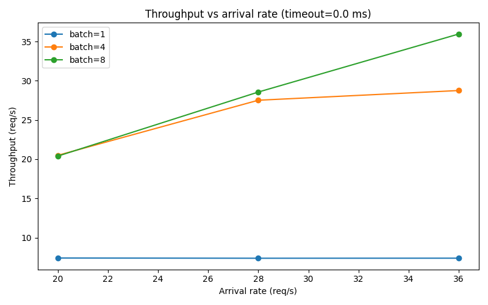
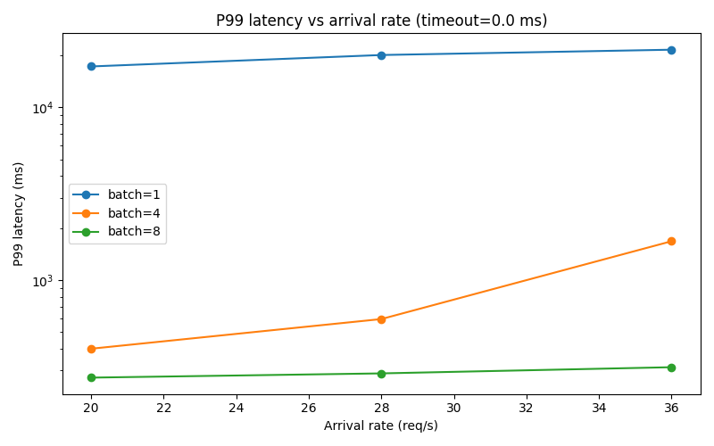
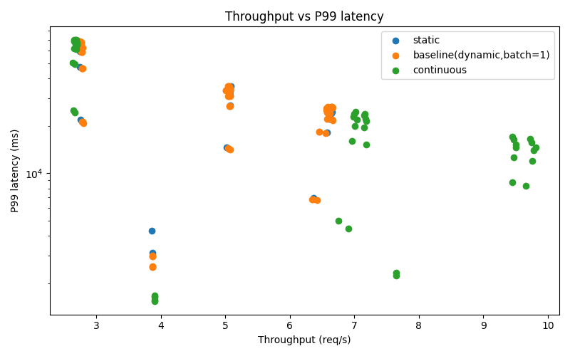

# Efficient Inference Systems: KV Cache and Dynamic Batching in a Controlled Transformer Serving Benchmark

## Overview

This project isolates two core transformer serving mechanisms: **KV caching** and **dynamic batching**. The system includes a decoder-only transformer, two inference paths (with and without KV cache), a synthetic request generator, a FIFO dynamic batching scheduler, and benchmarking code for latency, throughput, and memory tradeoffs.

The benchmark targets two questions:

- How does KV caching change decode-time scaling as prompt length grows?
- How do batch size and batching timeout affect throughput and tail latency under load?

---

## System

### Model configuration

| Parameter | Value |
|---|---:|
| Vocabulary size | 5000 |
| Hidden size (`d_model`) | 512 |
| Attention heads | 8 |
| Transformer layers | 6 |
| Feed-forward size (`d_ff`) | 2048 |
| Max sequence length | 1024 |

### Environment

| Component | Value |
|---|---|
| Instance | AWS `g4dn.xlarge` |
| GPU | NVIDIA Tesla T4 |
| GPU memory | 14.56 GB |
| Python | 3.12.3 |
| PyTorch | 2.9.1+cu130 |
| CUDA | 13.0 |
| cuDNN | 91300 |
| Precision | FP32 |

### Inference paths

Two generation paths were benchmarked:

1. **No-cache generation**: recomputes attention over the full sequence at every decode step.
2. **KV-cache generation**: performs one prompt prefill pass, stores keys and values, and reuses them during autoregressive decoding.

### Scheduler

The serving simulator uses:

- Poisson request arrivals
- FIFO pending queue
- non-preemptive execution
- dispatch on either:
  - queue size reaching `max_batch_size`, or
  - oldest request waiting `batch_timeout_ms`

All dynamic batching runs used the **KV-cache generation path** for batch execution.

This benchmark uses whole-request batching rather than token-level continuous batching.

---

## Experimental Configuration

### KV cache experiment

| Parameter | Value |
|---|---|
| Prompt lengths | `[128, 256, 512, 768]` |
| Max new tokens | `128` |
| Repeats | `3` |
| Warmup runs | `1` |
| Batch size | `1` |
| Seed | `42` |

### Dynamic batching experiment

| Parameter | Value |
|---|---|
| Arrival rates (req/s) | `[20.0, 28.0, 36.0]` |
| Max batch sizes | `[1, 4, 8]` |
| Batch timeouts (ms) | `[0.0, 10.0, 20.0]` |
| Requests per run | `200` |
| Prompt length | `128` |
| Max new tokens | `32` |
| Repeats | `3` |
| Seed | `42` |

---

## Results

### 1. KV Cache

KV caching changes the scaling behavior of decode. Over the tested prompt lengths, the no-cache path became increasingly expensive, while the cached path kept generated-token latency much flatter at the cost of additional memory.

### Latency behavior

<table>
  <tr>
    <td align="center">
      
    </td>
    <td align="center">
      
    </td>
  </tr>
</table>

Together, these plots show both the end-to-end and per-token effect of caching. Total generation time diverged quickly as prompt length increased, and by prompt length `768`, the cached path was more than `3x` faster overall. At the same time, generated-token latency rose from about `4.16 ms` to `16.12 ms` without caching, while staying roughly in the `4.2–4.9 ms` range with caching.

### Memory behavior

  

Cache memory grew approximately linearly over the tested range, from `5.98 MB` at prompt length `128` to `20.98 MB` at `768`. The decode-time improvement therefore comes with a direct memory tradeoff: caching reduces repeated computation, but requires storing more keys and values as context grows.

### Summary table

| Prompt Length | No Cache (ms) | With Cache (ms) | Speedup | Cache Memory (MB) |
|---|---:|---:|---:|---:|
| 128 | 538.07 | 531.98 | 1.01x | 5.98 |
| 256 | 751.24 | 614.43 | 1.22x | 10.98 |
| 512 | 1359.68 | 642.54 | 2.12x | 15.98 |
| 768 | 2292.91 | 700.23 | 3.27x | 20.98 |

Across the tested range, KV caching kept decode cost much flatter while the no-cache path scaled poorly with context length. End-to-end speedup increased with prompt length, while memory usage rose roughly linearly.

---

## 2. Dynamic Batching

Dynamic batching materially changed the operating regime of the system. Small batches left the service overloaded across all tested arrival rates, while larger batch caps increased service capacity enough to keep tail latency in a much lower range.

### Capacity and tail-latency behavior

<table>
  <tr>
    <td align="center">
      
    </td>
    <td align="center">
      
    </td>
  </tr>
</table>

Together, these plots show how batch size changed both service capacity and tail behavior. With `max_batch_size = 1`, throughput stayed near `~7.37 req/s`, well below the offered load at every tested arrival rate, while p99 latency remained on the order of `~17–21.6 s`, indicating persistent overload. Larger batch caps increased throughput substantially; `batch=8` reached `~36.17 req/s` at the highest tested load while keeping p99 latency in roughly the `272–331 ms` range, whereas `batch=4` remained intermediate and began approaching saturation at higher arrival rates.

### Tradeoff behavior

  

The throughput-versus-p99 scatter best summarizes the batching tradeoff. As batch size increased, the system sustained higher throughput while keeping p99 latency in a much lower range. In this workload, larger batches moved the service out of a queueing-collapse regime and into a much more stable operating region.

### Summary table

| Batch Cap | Throughput Range (req/s) | P99 Latency Range |
|---|---:|---:|
| 1 | ~7.37 | ~17–21.6 s |
| 4 | ~20.5–28.8 | up to ~1.68 s |
| 8 | ~20.4–36.17 | ~272–331 ms |

Timeout had only a secondary effect in the tested regime; the dominant behavior change came from batch cap.

---

## Limitations

This benchmark is intentionally controlled and omits several production concerns:

- fixed prompt length within a scheduling run
- fixed `max_new_tokens` within a batch
- FIFO whole-request batching rather than token-level continuous batching
- single model size
- single GPU type
- synthetic arrivals instead of production traces

These constraints keep the benchmark controlled and isolated, but they also limit direct comparability to production serving systems.

---

## Conclusion

This benchmark isolates two core serving behaviors. KV caching kept decode cost much flatter as context length increased, while dynamic batching materially increased service capacity and reduced tail latency under load. While the benchmark is intentionally controlled, the underlying tradeoffs—cache reuse, queue buildup, utilization, and memory growth—are the same ones that shape larger transformer serving systems.
