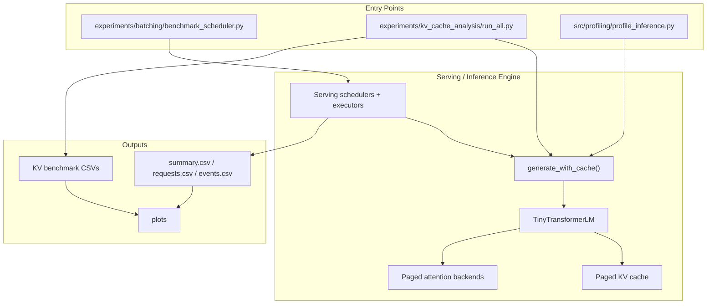
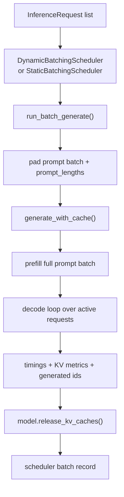
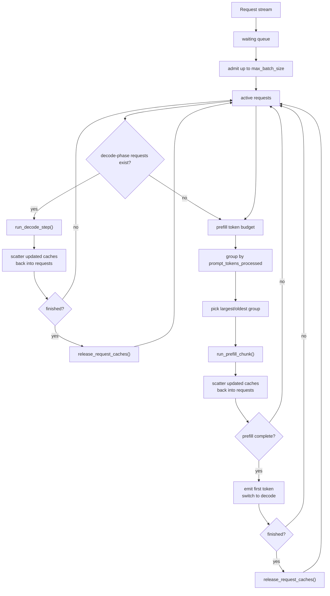
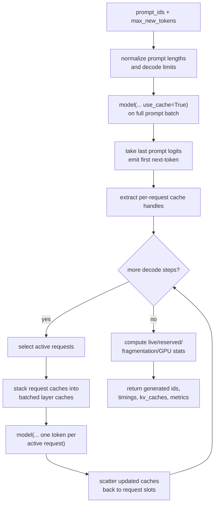
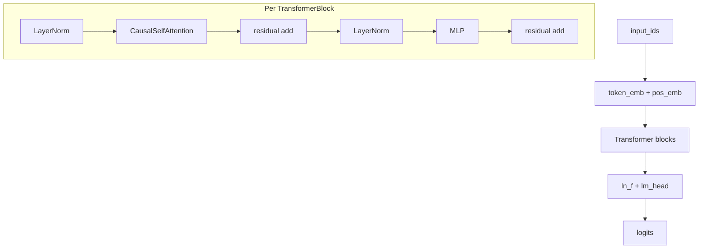
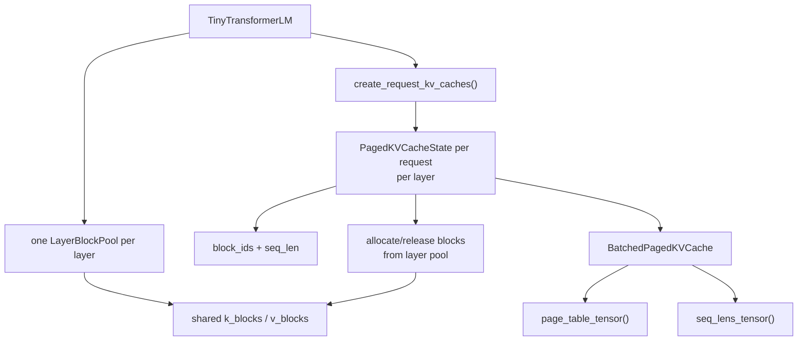
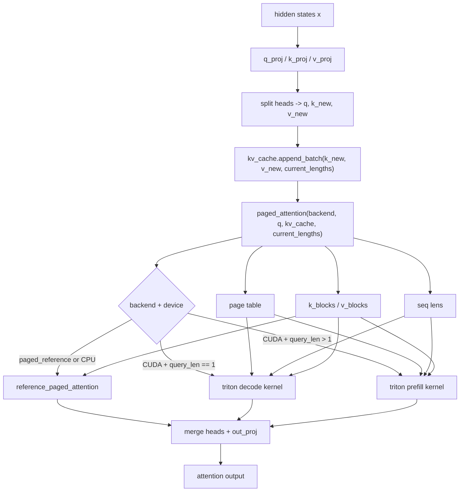
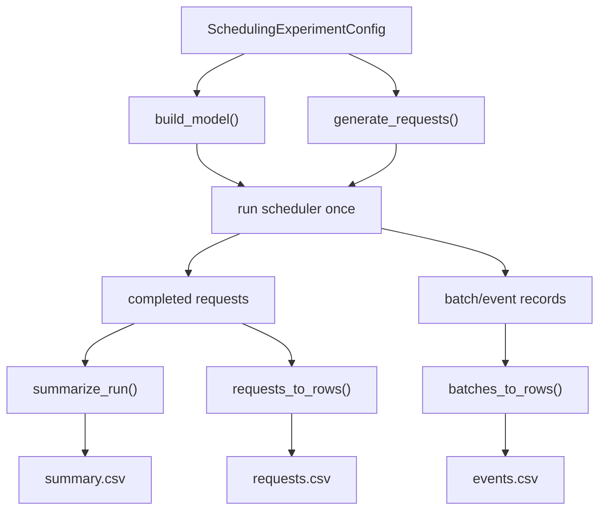

# Engine Diagram Preview

These diagrams are intentionally split by concern so each one stays readable in Markdown preview.

## 1. Top-Level Map

## 2. Whole-Request Batching Path

This is the static/dynamic batching path.

## 3. Continuous Scheduling Path

## 4. `generate_with_cache()` Runtime

## 5. Model Internals

## 6. Paged KV Cache Design

## 7. Cached Attention Execution

## 8. Scheduler Benchmark Data Flow

