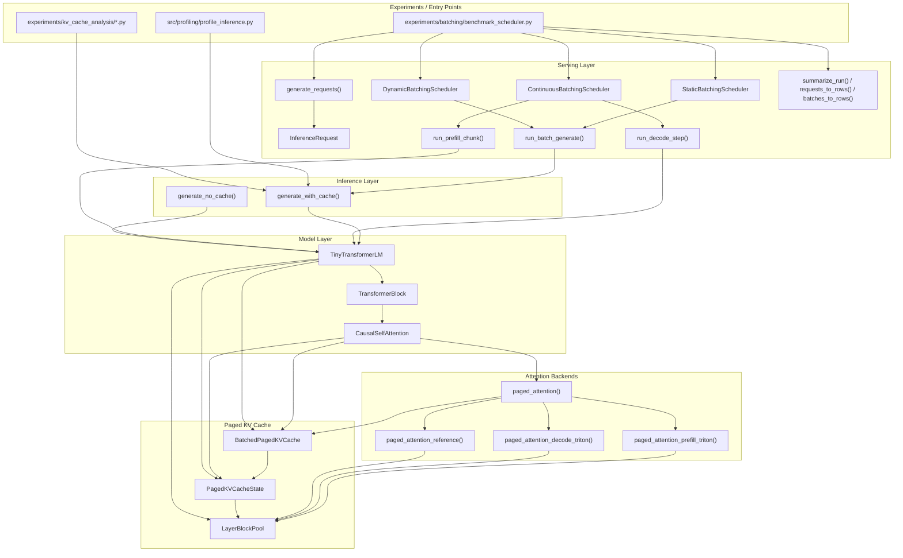
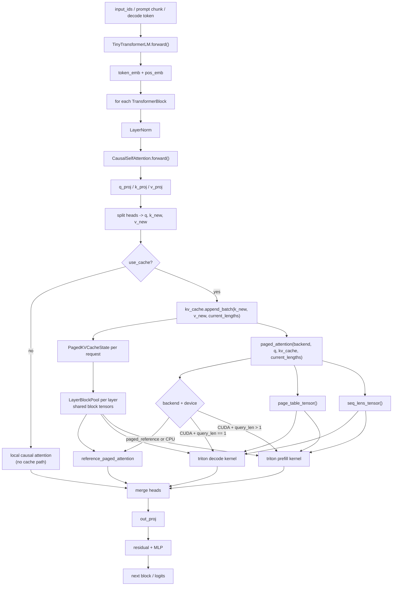
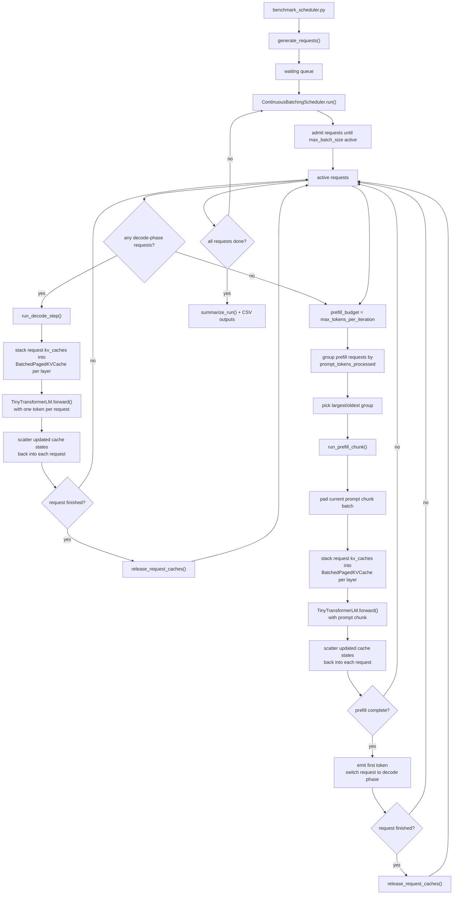

# Engine Diagram Preview

## High-Level Engine Architecture

```mermaid
flowchart TD
  subgraph EXP["Experiments / Entry Points"]
    Bench["experiments/batching/benchmark_scheduler.py"]
    KVExp["experiments/kv_cache_analysis/*.py"]
    Profile["src/profiling/profile_inference.py"]
  end

  subgraph SERVE["Serving Layer"]
    LoadGen["generate_requests()"]
    Req["InferenceRequest"]
    Dyn["DynamicBatchingScheduler"]
    Stat["StaticBatchingScheduler"]
    Cont["ContinuousBatchingScheduler"]
    BatchExec["run_batch_generate()"]
    PrefillExec["run_prefill_chunk()"]
    DecodeExec["run_decode_step()"]
    Metrics["summarize_run() / requests_to_rows() / batches_to_rows()"]
  end

  subgraph INF["Inference Layer"]
    GenCache["generate_with_cache()"]
    GenNoCache["generate_no_cache()"]
  end

  subgraph MODEL["Model Layer"]
    LM["TinyTransformerLM"]
    Block["TransformerBlock"]
    Attn["CausalSelfAttention"]
  end

  subgraph CACHE["Paged KV Cache"]
    Pool["LayerBlockPool"]
    State["PagedKVCacheState"]
    BState["BatchedPagedKVCache"]
  end

  subgraph KERNELS["Attention Backends"]
    Dispatch["paged_attention()"]
    Ref["paged_attention_reference()"]
    TriDec["paged_attention_decode_triton()"]
    TriPre["paged_attention_prefill_triton()"]
  end

  Bench --> LoadGen
  Bench --> Dyn
  Bench --> Stat
  Bench --> Cont
  Bench --> Metrics

  KVExp --> GenCache
  Profile --> GenCache
  GenNoCache --> LM

  LoadGen --> Req

  Dyn --> BatchExec
  Stat --> BatchExec
  Cont --> PrefillExec
  Cont --> DecodeExec

  BatchExec --> GenCache
  PrefillExec --> LM
  DecodeExec --> LM

  GenCache --> LM

  LM --> Block
  Block --> Attn

  LM --> Pool
  LM --> State
  LM --> BState

  Attn --> BState
  Attn --> State
  Attn --> Dispatch

  BState --> State
  State --> Pool

  Dispatch --> Ref
  Dispatch --> TriDec
  Dispatch --> TriPre
  Dispatch --> BState

  Ref --> Pool
  TriDec --> Pool
  TriPre --> Pool
```

## Model + Paged KV + Triton Backend

```mermaid
flowchart TD
  Input["input_ids / prompt chunk / decode token"] --> LM["TinyTransformerLM.forward()"]

  LM --> Pos["token_emb + pos_emb"]
  Pos --> Blocks["for each TransformerBlock"]

  Blocks --> LN1["LayerNorm"]
  LN1 --> Attn["CausalSelfAttention.forward()"]

  Attn --> QKV["q_proj / k_proj / v_proj"]
  QKV --> Split["split heads -> q, k_new, v_new"]

  Split --> CacheMode{"use_cache?"}
  CacheMode -- no --> DensePath["local causal attention\n(no cache path)"]
  CacheMode -- yes --> Append["kv_cache.append_batch(k_new, v_new, current_lengths)"]

  Append --> PageState["PagedKVCacheState per request"]
  PageState --> Pool["LayerBlockPool per layer\nshared block tensors"]

  Append --> Dispatch["paged_attention(backend, q, kv_cache, current_lengths)"]

  Dispatch --> Backend{"backend + device"}
  Backend -- "paged_reference or CPU" --> Ref["reference_paged_attention"]
  Backend -- "CUDA + query_len == 1" --> TriDec["triton decode kernel"]
  Backend -- "CUDA + query_len > 1" --> TriPre["triton prefill kernel"]

  Dispatch --> PageTable["page_table_tensor()"]
  Dispatch --> SeqLens["seq_lens_tensor()"]

  PageTable --> TriDec
  PageTable --> TriPre
  SeqLens --> TriDec
  SeqLens --> TriPre
  Pool --> Ref
  Pool --> TriDec
  Pool --> TriPre

  Ref --> Merge["merge heads"]
  TriDec --> Merge
  TriPre --> Merge
  DensePath --> Merge

  Merge --> OutProj["out_proj"]
  OutProj --> Residual["residual + MLP"]
  Residual --> Next["next block / logits"]
```

## Continuous Serving Runtime Flow

```mermaid
flowchart TD
  Start["benchmark_scheduler.py"] --> GenReq["generate_requests()"]
  GenReq --> Waiting["waiting queue"]
  Waiting --> Sched["ContinuousBatchingScheduler.run()"]

  Sched --> Admit["admit requests until max_batch_size active"]
  Admit --> Active["active requests"]

  Active --> DecodeCheck{"any decode-phase requests?"}

  DecodeCheck -- yes --> DecodeStep["run_decode_step()"]
  DecodeStep --> StackDecode["stack request kv_caches into\nBatchedPagedKVCache per layer"]
  StackDecode --> ModelDecode["TinyTransformerLM.forward()\nwith one token per request"]
  ModelDecode --> ScatterDecode["scatter updated cache states\nback into each request"]
  ScatterDecode --> DoneDecode{"request finished?"}
  DoneDecode -- yes --> ReleaseDecode["release_request_caches()"]
  DoneDecode -- no --> Active

  DecodeCheck -- no --> Budget["prefill_budget = max_tokens_per_iteration"]

  ReleaseDecode --> Active
  Active --> Budget

  Budget --> PrefillGroups["group prefill requests by\nprompt_tokens_processed"]
  PrefillGroups --> PickGroup["pick largest/oldest group"]
  PickGroup --> PrefillStep["run_prefill_chunk()"]
  PrefillStep --> PadChunk["pad current prompt chunk batch"]
  PadChunk --> StackPrefill["stack request kv_caches into\nBatchedPagedKVCache per layer"]
  StackPrefill --> ModelPrefill["TinyTransformerLM.forward()\nwith prompt chunk"]
  ModelPrefill --> ScatterPrefill["scatter updated cache states\nback into each request"]
  ScatterPrefill --> PrefillDone{"prefill complete?"}

  PrefillDone -- no --> Active
  PrefillDone -- yes --> FirstToken["emit first token\nswitch request to decode phase"]
  FirstToken --> Finished{"request finished?"}
  Finished -- yes --> ReleasePrefill["release_request_caches()"]
  Finished -- no --> Active

  ReleasePrefill --> Active
  Active --> Loop{"all requests done?"}
  Loop -- no --> Sched
  Loop -- yes --> Metrics["summarize_run() + CSV outputs"]
```
