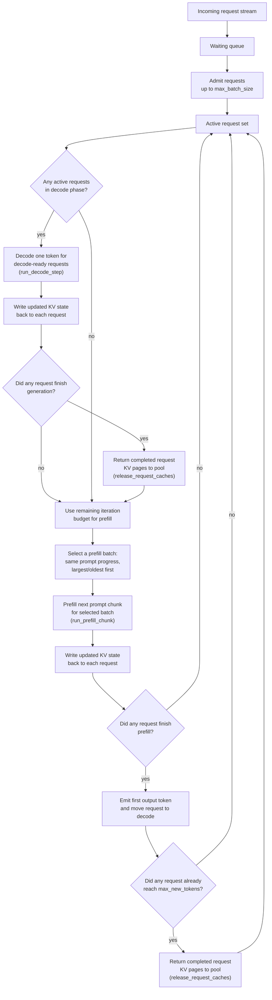
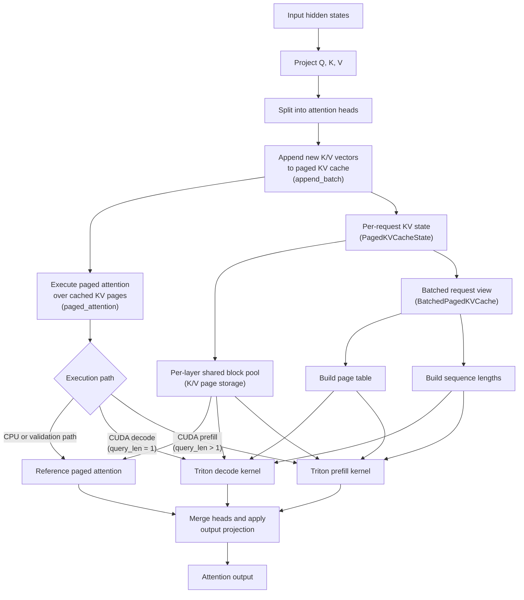

# Final Writeup Diagram Preview

These are the two diagrams I would keep for the final Markdown writeup.

## 1. Continuous Serving Flow

```mermaid
flowchart TD
  Stream["Incoming request stream"] --> WaitQ["Waiting queue"]
  WaitQ --> Admit["Admit requests\nup to max_batch_size"]
  Admit --> Active["Active request set"]

  Active --> CheckDecode{"Any active requests\nin decode phase?"}

  CheckDecode -- yes --> Decode["Decode one token for\ndecode-ready requests\n(run_decode_step)"]
  Decode --> ScatterD["Write updated KV state\nback to each request"]
  ScatterD --> DoneD{"Did any request finish\ngeneration?"}
  DoneD -- yes --> ReleaseD["Return completed request\nKV pages to pool\n(release_request_caches)"]
  DoneD -- no --> Budget["Use remaining iteration\nbudget for prefill"]

  CheckDecode -- no --> Budget
  ReleaseD --> Budget

  Budget --> Pick["Select a prefill batch:\nsame prompt progress,\nlargest/oldest first"]
  Pick --> Prefill["Prefill next prompt chunk\nfor selected batch\n(run_prefill_chunk)"]
  Prefill --> ScatterP["Write updated KV state\nback to each request"]
  ScatterP --> DoneP{"Did any request finish\nprefill?"}
  DoneP -- no --> Active
  DoneP -- yes --> First["Emit first output token\nand move request to decode"]
  First --> FinishP{"Did any request already\nreach max_new_tokens?"}
  FinishP -- yes --> ReleaseP["Return completed request\nKV pages to pool\n(release_request_caches)"]
  FinishP -- no --> Active

  ReleaseP --> Active
```

## 2. Paged Attention Execution

```mermaid
flowchart TD
  X["Input hidden states"] --> Proj["Project Q, K, V"]
  Proj --> Split["Split into attention heads"]
  Split --> Append["Append new K/V vectors\nto paged KV cache\n(append_batch)"]
  Append --> Dispatch["Execute paged attention\nover cached KV pages\n(paged_attention)"]

  Append --> State["Per-request KV state\n(PagedKVCacheState)"]
  State --> Pool["Per-layer shared block pool\n(K/V page storage)"]
  State --> Batch["Batched request view\n(BatchedPagedKVCache)"]

  Batch --> PT["Build page table"]
  Batch --> SL["Build sequence lengths"]

  Dispatch --> Choose{"Execution path"}
  Choose -- "CPU or validation path" --> Ref["Reference paged attention"]
  Choose -- "CUDA decode\n(query_len = 1)" --> TriD["Triton decode kernel"]
  Choose -- "CUDA prefill\n(query_len > 1)" --> TriP["Triton prefill kernel"]

  PT --> TriD
  PT --> TriP
  SL --> TriD
  SL --> TriP
  Pool --> Ref
  Pool --> TriD
  Pool --> TriP

  Ref --> Merge["Merge heads and apply\noutput projection"]
  TriD --> Merge
  TriP --> Merge
  Merge --> Out["Attention output"]
```
