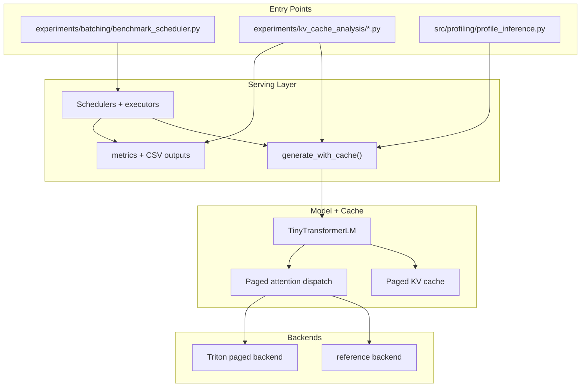
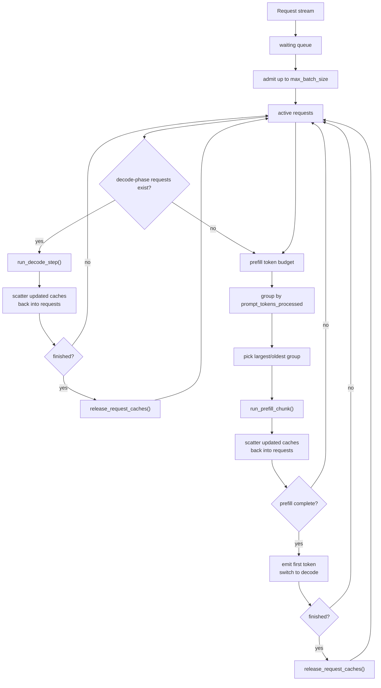
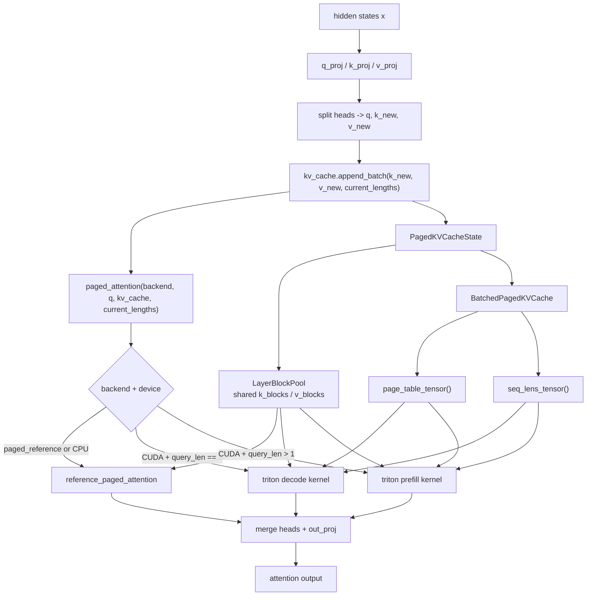

# Final Writeup Diagram Preview

These are the three diagrams I would keep for the final Markdown writeup.

## 1. System Architecture

## 2. Continuous Serving Flow

## 3. Paged Attention Execution

